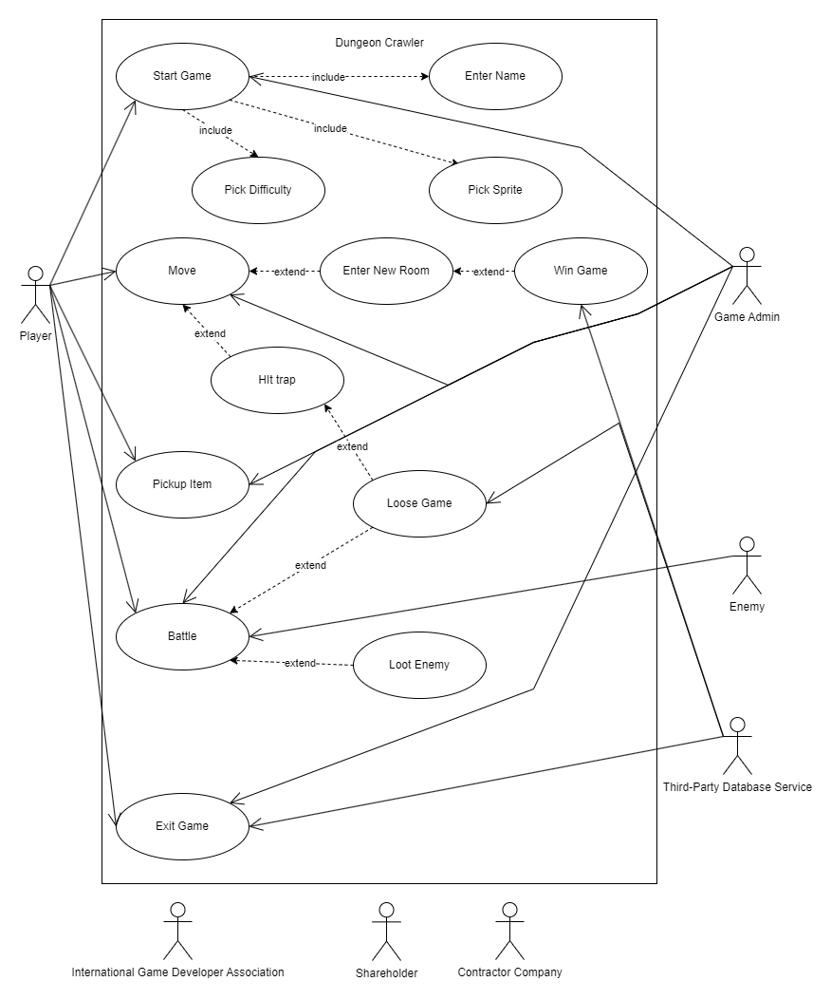
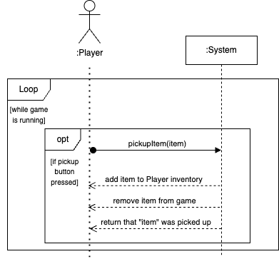
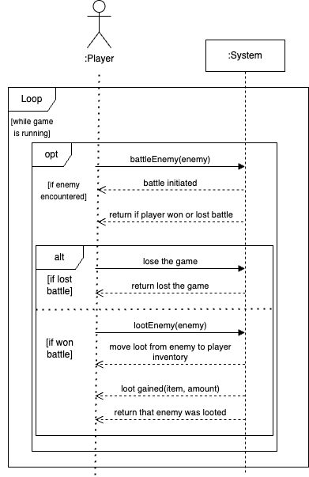
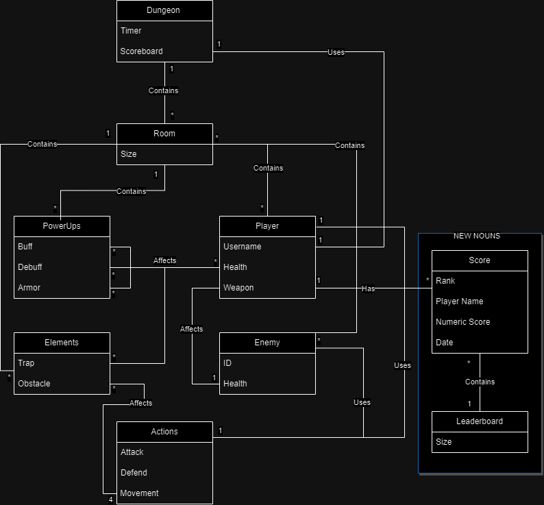
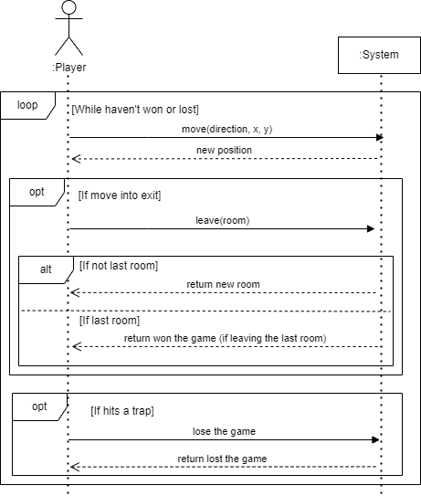

# Dungeon Game

Welcome to Dungeon Game, a 2D Dungeon Crawler where you navigate through challenging rooms filled with enemies and power-ups, all in a quest to survive and rack up a high score.

## Team Presentation

| Member Name        | Role          | Bio           | Contributions |
|--------------------|---------------|---------------|---------------|
|  | [Role in Team] | [Brief Bio]  | [Skills and Contributions] |
|  | [Role in Team] | [Brief Bio]  | [Skills and Contributions] |
|  | [Role in Team] | [Brief Bio]  | [Skills and Contributions] |
|  | [Role in Team] | [Brief Bio]  | [Skills and Contributions] |
|  | [Role in Team] | [Brief Bio]  | [Skills and Contributions] |

---

## Game Description

### Genre
This game is a 2D Dungeon Crawler.

### Storyline
Navigate through dungeon rooms, each with its own unique layout and set of enemies. The goal is to reach the exit of each room to progress, ultimately aiming for a high score.

### Gameplay Mechanics
- Fixed viewpoint rooms
- Character movement in four directions
- Different types of enemies with distinct movement patterns
- Collectible power-ups
- Health and damage system
- Leaderboard for high scores

### Development Process

The project progressed through five interconnected sprints:

Sprint 1 ➜ Sprint 2 ➜ Sprint 3 ➜ Sprint 4 ➜ Sprint 5

| Feature/Icon | **Sprint 1**                                                                 | **Sprint 2**                                                                           | **Sprint 3**                        | **Sprint 4**                                 | **Sprint 5**             |
|--------------|------------------------------------------------------------------------------|---------------------------------------------------------------------------------------|------------------------------------|-----------------------------------------------|-------------------------|
| Main Focus   | Initial Setup                                                               | Game Basics                                                                           | Movement                           | Enemy Interaction                            | Advanced Gameplay       |
| Feature 1    | 🖥️ Initial UI setup: start, configuration, and game screens.                | 🎮 Basic game screen elements: rooms, score display, and leaderboard.                | 🚀 Movement mechanics.            | 👾 Introduction of different enemy types.   | ⚔️ Attack mechanics.   |
| Feature 2    | 📝 Name input and difficulty selection.                                      | ➡️ Temporary next button for navigation.                                              | 🚫 Wall collisions.               | ❤️ Health and damage system.                | ✨ Power-ups.            |

🔹 **Sprint 1**: 
   - 🖥️ Initial UI setup: start, configuration, and game screens.
   - 📝 Name input and difficulty selection.

🔹 **Sprint 2**: 
   - 🎮 Basic game screen elements: rooms, score display, and leaderboard.
   - ➡️ Temporary next button for navigation.

🔹 **Sprint 3**: 
   - 🚀 Movement mechanics.
   - 🚫 Wall collisions.

🔹 **Sprint 4**: 
   - 👾 Introduction of different enemy types.
   - ❤️ Health and damage system.

🔹 **Sprint 5**: 
   - ⚔️ Attack mechanics.
   - ✨ Power-ups.

### Sprint 1: Domain Model and Use Case Diagram

#### Domain Model

The domain model represents the main entities in our game system, showing their relationships and attributes. Here are some key points:
- **Dungeon**: This is the main component of the game where all the action takes place. It contains multiple rooms and has a timer and scoreboard.
- **Player**: Represents the user-controlled character. Players have attributes like username, health, and weapons. They can also use power-ups.
- **Enemy**: The antagonists in the game. Each enemy has an ID and health attribute.
- **PowerUps & Elements**: In-game items and obstacles. PowerUps like 'Bul', 'Delbul', and 'Armor' can affect players' or enemies' health, while elements like traps and obstacles can hinder the player's progression.
- **Actions**: Various actions that players and enemies can take, including attacking, defending, and moving.

#### Use Case Diagram

The use case diagram depicts the interactions between the user (player) and the system:
- **Start Game**: Initiates the game session.
- **Enter Name & Pick Sprite**: Personalization options for the player's character.
- **Move & Enter New Room**: Core gameplay mechanics allowing exploration of the dungeon.
- **Battle & Loot Enemy**: Combat mechanics where players can engage with enemies.
- **Pickup Item**: Players can collect items, enhancing their abilities.
- **Win & Lose Game**: Potential outcomes based on player's performance.

### Sprint 2: Advanced Game Mechanics and System Interactions

#### Use Case Diagram: Item Pickup

This diagram showcases the process of a player picking up an item in the game. While the game is running:
- Optionally, if the player presses the pickup button, the system facilitates the action `pickupItem(item)`.
- The chosen item is added to the player's inventory.
- That specific item is then removed from the game's environment.
- A confirmation is returned indicating that the item was successfully picked up.

#### Use Case Diagram: Battle Mechanics

This diagram details the combat system of the game:
- When the game is running and the player encounters an enemy, the `battleEnemy(enemy)` process is optionally initiated.
- The system then returns the outcome of the battle, indicating whether the player has won or lost.
- In the event of a player's loss, the game concludes with a "lost game" status.
- Conversely, if the player is victorious, they have the opportunity to loot the enemy, transferring items or other rewards to their inventory.

#### Domain Model: Extended Game Entities

This expanded domain model introduces additional components to the game:
- **Score**: Represents the player's achievement, consisting of rank, player name, numeric score, and date.
- **Leaderboard**: Holds a collection of scores, showcasing players' rankings.
These additions interlink with the original entities, enriching the game's complexity and depth.

#### Use Case Diagram: Movement and Progression

This diagram captures the movement mechanics within the game:
- Throughout gameplay, the player can move in different directions until they either win or lose.
- If the player moves towards an exit, they have the option to leave the current room.
- Based on the room sequence, the system determines if the player has reached the last room or if they need to progress to another.
- Winning can be achieved by exiting the final room, whereas encountering a trap may lead to a game loss.

## Sprint 3 Analysis

### Use Case: Use PowerUp
- **Actor**: Generic user or player character.
- **Flow**:
  1. The player picks up a power-up.
  2. The power-up's `applyPowerUp(player)` method is invoked.
  3. Depending on the type of power-up (buff or debuff):
     - If it's a buff, the player's score increases.
     - If it's a debuff, the player's score decreases.
  4. The player's score is updated.

### Class Diagram
- **Score**:
  - Attributes: rank, numeric score, player name, date.
  - Operations: `displayScore(Score)`.
- **Dungeon**:
  - Attributes: timer.
  - Operations: `switchCurrentRoom(Room)`.
  - Association: Contains multiple rooms.
- **Room**: 
  - Attributes: size.
  - Association: Contains multiple power-ups.
- **PowerUp (Interface)**:
  - Attributes: id, location x & y.
  - Operations: `applyPowerUp(Player)`.
  - Association: Implemented by Buff and Debuff.
- **Player & Enemy (Implementing Person Interface)**:
  - Common Attributes: name, location x & y, health.
  - Player Specific Operations: `attack(Enemy)`, `startGame(Dungeon)`.
  - Enemy Specific Operations: `attack(Player)`.

### Use Case: User Interface Interaction
- **Actor**: Generic user.
- **Flow**:
  1. The user interface continuously displays the player's score.
  2. The score updates during gameplay.
  3. Optionally, if the score is within the top 5, it's added to the leaderboard.
  4. The leaderboard is displayed.

### Use Case: Interact with Enemy
- **Actor**: Player character.
- **Flow**:
  1. Battle is initiated with an enemy.
  2. The player and enemy enter a loop of attacking each other as long as their health is above 0.
  3. Optionally, if the enemy's health is above 0, the enemy can choose to defend.

